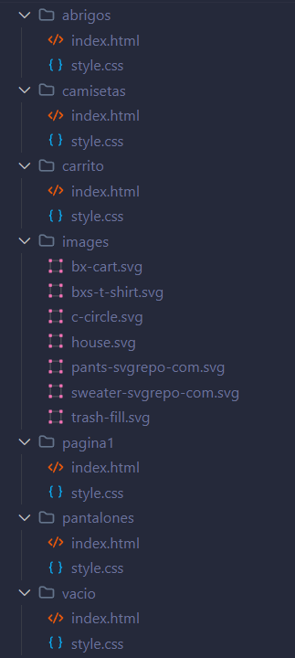

# CampusShop
## Descripción
Esto es una página de compra en línea donde los usuarios podran conprar una variedad de productos.

El objetivo de este proyecto es brindar una experiencia al usuario de compra rapida y sencilla.

## Instalación
Para probar esta página primero deberas descargar este repositorio, luego tienes que abrirlo en **visual studio code** e instalar una extensión llamada **Live Server**, una vez instalada te diriges a la carpeta **pagina1** luego al archivo index.html, estando en este archivo en la esquina inferior derecha verás un apartado donde dice *Go Live* le das click y ya se abrirá la página.

## Carpetas
|nombre|descripcion|
|--|--|
|abrigos|Aquí se encuentra el código de la página de abrigos|
|camisetas|Aquí se encuentra el código de la página de camisetas|
|carrito|Aquí se encuentra el código de la página del carrito|
|images|Aquí se almacenan todas la imagenes usadas en la página|
|pagina1|Aquí se encuentra el código de la página que muestra todos los productos|
|pantalones|Aquí se encuentra el código de la página de pantalones|
|abrigos|Aquí se encuentra el código de una página que muestra que el carrito está vácio|

## Estructura

## tecnologias utilizadas
- HTML 5
- CSS 3

## Autor
- Luis Miguel Caicedo Bermon